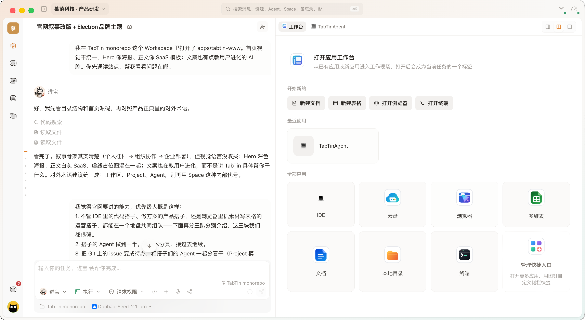

  

<h1 align="center">TabTin</h1>

<strong>你、搭子、Agent，在同一工作区里碰头。</strong>

People, teammates, and Agents, meeting in one workspace.

  <a href="https://www.tabtin.com/">官网</a> ·
  <a href="https://www.tabtin.com/download/">免费下载</a>

你开着的东西，搭子和 Agent 都看得见。不用粘贴聊天记录，也不用再解释一遍「做到哪了」。

不管写方案、抓素材，还是写代码，人和多个 Agent 在同一个工作区组队。产出就落在现场，谁接着干都能看见做到哪了。

想先上手，去官网 [免费下载桌面版](https://www.tabtin.com/download/)。
